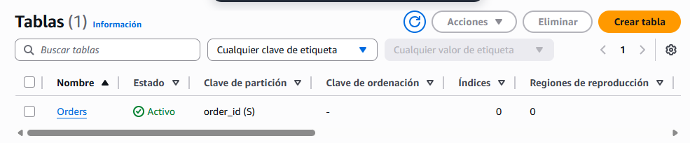
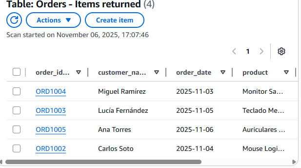
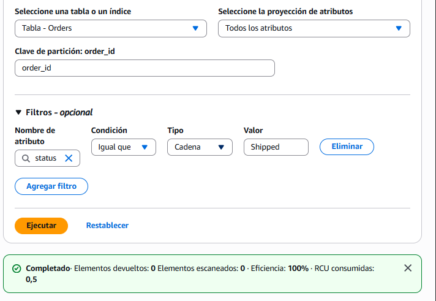
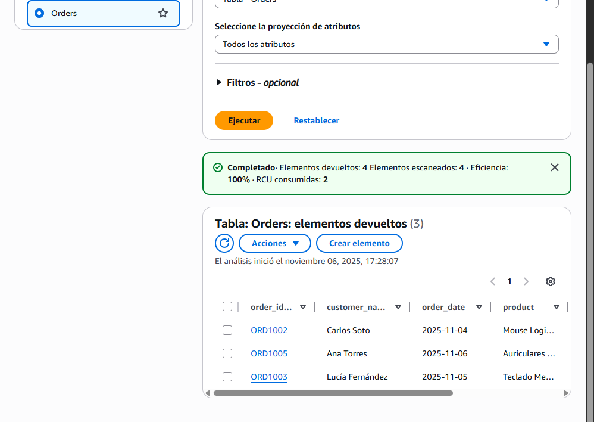
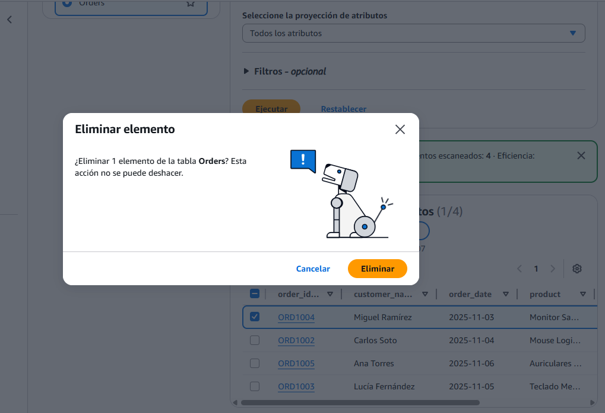

# 1. Creando nuestra primera tabla en la nube

###  **Captura 1:** Muestra una imagen de tu tabla Orders creada correctamente en la consola de DynamoDB.

.png)

---

# 2. Insertando nuestros primeros pedidos

### **Captura 2:** Muestra una vista de la tabla con todos los ítems que has creado.

---

# 3. Explorando y modificando los datos

### **Captura 3:** Incluye una captura del filtro aplicado y otra del ítem que has actualizado.

---

# 4. Eliminando un pedido

### **Captura 4:** Muestra el resultado de la tabla después de haber eliminado uno de los ítems.

---

# **Reflexión Final:** DynamoDB en el Ecosistema NoSQL

**Comparativa:** En Dynamodb veo mas sencillo la manera de insercción de datos, ademas que el entorno visual lo veo más sencillo que NoSQL. A la hora tanto de ver los datos, como de interactuar con ellos.

**Ventajas Serverless:** 

*   **Ventajas:** Pues que a la hora de crear con bastantes personas no es necesrio tener un repositorio en el cual se tenga que estar actuliazando todo el rato y tengan conflicos de datos ya que se actualizan de manera automatica. proyectos 

*   **Desventajas:** El mayor de los inconvenientes que veo ahora mismo es que tenemos que pagar, en cambio de la manera local no esta la necesidad de tener que pagar nada, aqui cuantas más cuentas estan conectadas el consumo sera mayor y el cobro más

**Experiencia:** lo más sencillo que he visto fue crear tablas y lo que más me costo fue hacer los filtros
