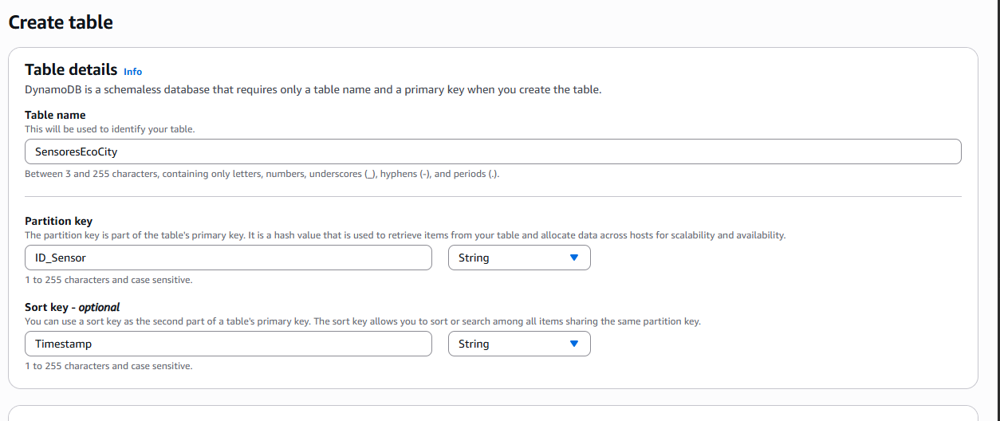
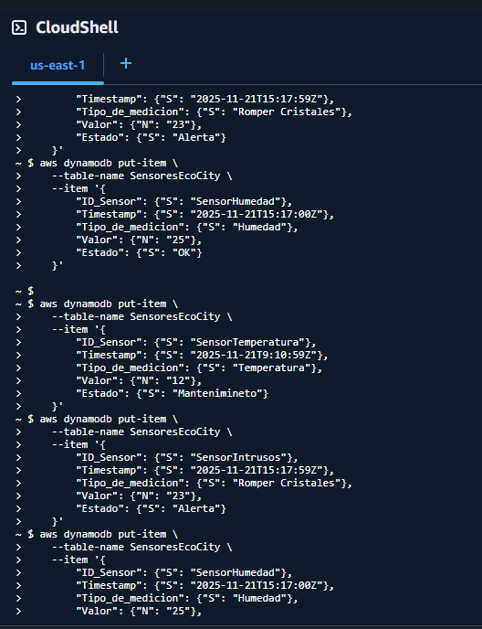
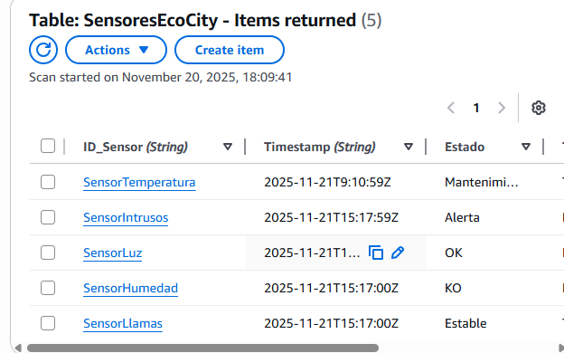
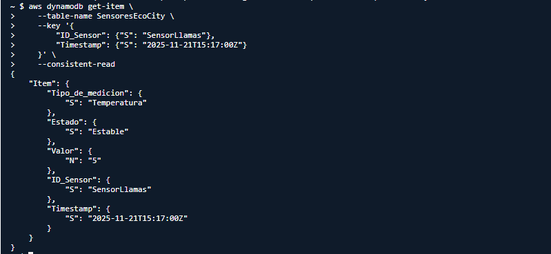
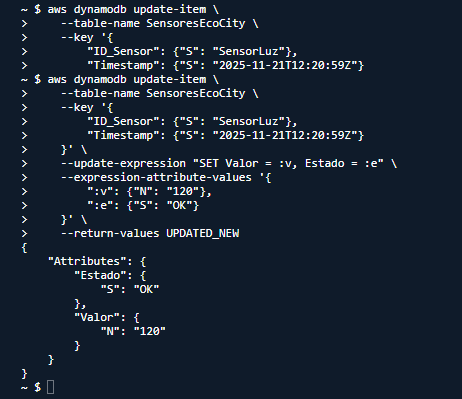
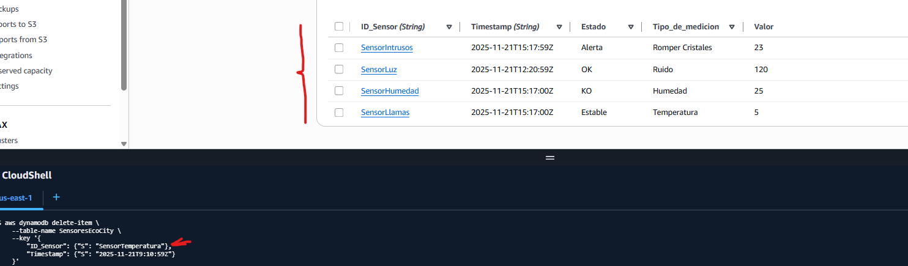

# Práctica DynamoDB – Sensores EcoCity

## Ejercicio 1 – Creación de la tabla

Para organizar las lecturas históricas de cada sensor, se definieron las claves:

- **Partition Key:** `ID_Sensor`
- **Sort Key:** `Timestamp`


### Captura del ejercicio



---

## Ejercicio 2 – Inserción de datos (Create)

Se añadieron cinco lecturas procedentes de distintos sensores.  
Cada una incluye tipo de medición, fecha, valor y estado.

```bash
aws dynamodb put-item \
    --table-name SensoresEcoCity \
    --item '{
        "ID_Sensor": {"S": "SensorLuz"},
        "Timestamp": {"S": "2025-11-21T12:20:59Z"},
        "Tipo_de_medicion": {"S": "Ruido"},
        "Valor": {"N": "100"},
        "Estado": {"S": "OK"}
    }'

aws dynamodb put-item \
    --table-name SensoresEcoCity \
    --item '{
        "ID_Sensor": {"S": "SensorTemperatura"},
        "Timestamp": {"S": "2025-11-21T9:10:59Z"},
        "Tipo_de_medicion": {"S": "Temperatura"},
        "Valor": {"N": "12"},
        "Estado": {"S": "Mantenimineto"}
    }'

aws dynamodb put-item \
    --table-name SensoresEcoCity \
    --item '{
        "ID_Sensor": {"S": "SensorIntrusos"},
        "Timestamp": {"S": "2025-11-21T15:17:59Z"},
        "Tipo_de_medicion": {"S": "Romper Cristales"},
        "Valor": {"N": "23"},
        "Estado": {"S": "Alerta"}
    }'

aws dynamodb put-item \
    --table-name SensoresEcoCity \
    --item '{
        "ID_Sensor": {"S": "SensorHumedad"},
        "Timestamp": {"S": "2025-11-21T15:17:00Z"},
        "Tipo_de_medicion": {"S": "Humedad"},
        "Valor": {"N": "25"},
        "Estado": {"S": "KO"}
    }'

aws dynamodb put-item \
    --table-name SensoresEcoCity \
    --item '{
        "ID_Sensor": {"S": "SensorLlamas"},
        "Timestamp": {"S": "2025-11-21T15:17:00Z"},
        "Tipo_de_medicion": {"S": "Temperatura"},
        "Valor": {"N": "5"},
        "Estado": {"S": "Estable"}
    }'
```





## Ejercicio 3. Consulta de Datos (Read – Query)

El objetivo era obtener solo una lectura concreta del sensor SensorLlamas, usando su clave primaria completa.

```bash
aws dynamodb get-item \
    --table-name SensoresEcoCity \
    --key '{
        "ID_Sensor": {"S": "SensorLlamas"},
        "Timestamp": {"S": "2025-11-21T15:17:00Z"}
    }' \
    --consistent-read
```


## Ejercicio 4. Actualización de Datos (Update)

Se revisó una lectura del sensor SensorLuz, modificando su valor y manteniendo el estado en OK tras la corrección.

```bash
aws dynamodb update-item \
    --table-name SensoresEcoCity \
    --key '{
        "ID_Sensor": {"S": "SensorLuz"},
        "Timestamp": {"S": "2025-11-21T12:20:59Z"}
    }' \
    --update-expression "SET Valor = :v, Estado = :e" \
    --expression-attribute-values '{
        ":v": {"N": "120"},
        ":e": {"S": "OK"}
    }' \
    --return-values UPDATED_NEW
```



## Ejercicio 5. Eliminación de Datos (Delete)

Se eliminó una lectura generada por un sensor defectuoso antes de activarse oficialmente.

```bash
aws dynamodb delete-item \
    --table-name SensoresEcoCity \
    --key '{
        "ID_Sensor": {"S": "SensorTemperatura"},
        "Timestamp": {"S": "2025-11-21T9:10:59Z"}
    }'

```


