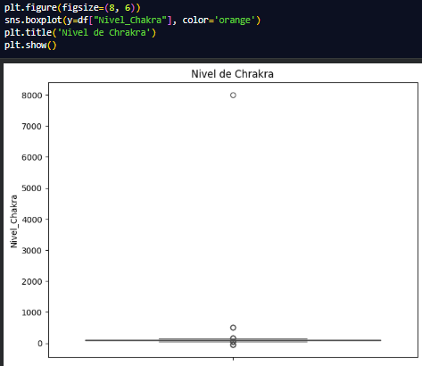
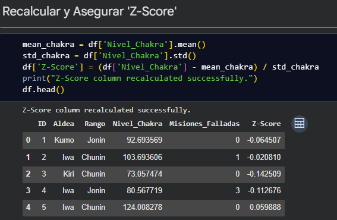
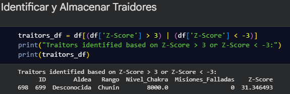
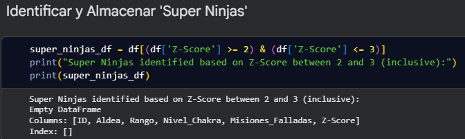
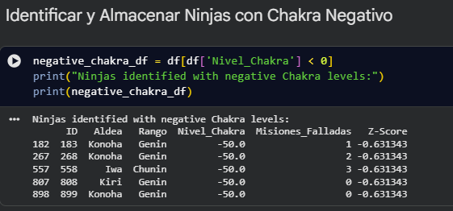
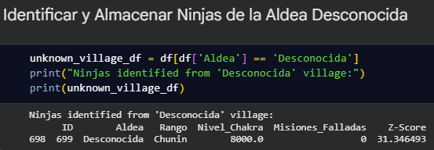

# Tarea Rafael Iván Sosa Arellano:(Detección de Anomalías)
# Imagen del Grafico:

Se nota que en el grafico se ve el outlayer de 8k.

---
# Los resultados de los `.head()`

## Recalcular y Asegurar 'Z-Score' 

## Identificar y Almacenar Traidores

## Identificar y Almacenar 'Super Ninjas'

## Identificar y Almacenar Ninjas con Chakra Negativo

## Identificar y Almacenar Ninjas de la Aldea Desconocida

---

# Preguntas Reflexión

## 1. ¿Por qué un outlier puede ser un error del sensor y no necesariamente un  ataque? Pon un ejemplo que hayas encontrado en el dataset.

Porque por algún motivo los dispositicos como los sensores u otro cualquiera, pueden llegar a dar valores desproporcionados u algun ususario alterarlos para que den valores sospechosos. 
Hay un usuario con el valor de 8000 de nivel de Chakra

## 2. Si eliminas los outliers, ¿cómo cambia la media del dataset? ¿Sube o baja?

Pues subiría pq ya no hay un valor de 8k que hace que lo desproporcione, entonces la emdía subirá.

## 3. ¿Sería justo castigar a los “Super Ninjas” (Z-Score > 2 pero < 3) solo por ser fuertes? Justifica tu respuesta estadística.
En verdad no sería justo castigarlos, ya que sn una miniría las cuales si que se pueden ver afectadas en los datos, pero no son desastrosamente desproporcionados.