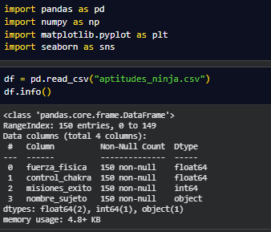
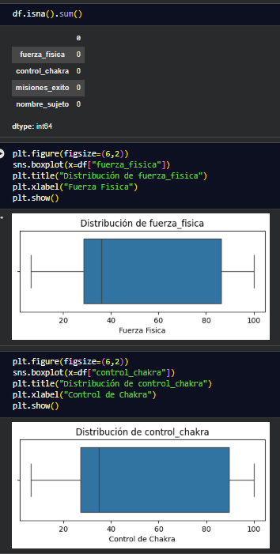
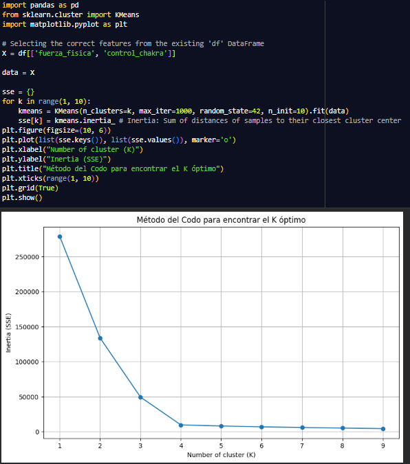
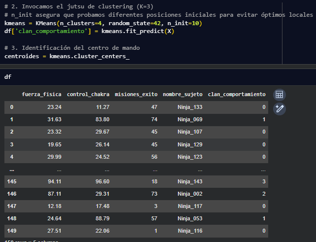
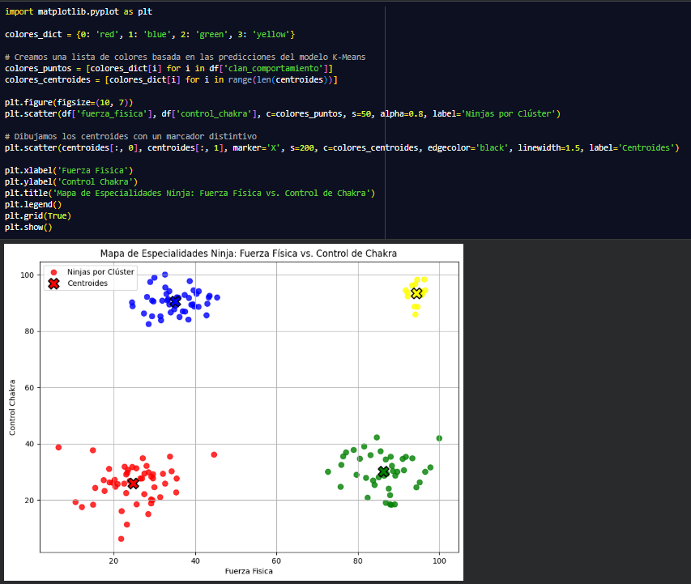

# Trabajo Rafael Iván Sosa Arellano sobre los KNN

# 0. Importamos el df
### Cargamos los datos y vemos las columnas que hay.

---
# 1. Exploración y Limpieza del CSV.
### Carga el CSV y verifica que no existan valores nulos o incoherentes (por ejemplo, chakra negativo). Solo utilizaremos las columnas numéricas de fuerza_fisica y control_chakra para el modelo.

---
# 2. Encontrar el “K” Óptimo.

### No sabemos cuántas unidades especializadas debemos crear. Aplica el Método del Codo evaluando inercias desde K=1 hasta K=10. Justifica tu elección del número de clústeres.

---
# 3. Entrenamiento y Clasificación.
### Entrena el modelo K-Means con el K elegido y asigna a cada ninja su clúster correspondiente. Añade esta etiqueta como una nueva columna en tu DataFrame original.

---
# 4. Mapa de Especialidades.
### Genera un gráfico de dispersión (Scatter Plot) donde el eje X sea la fuerza y el eje Y sea el chakra. Colorea los puntos por clúster y dibuja los centroides con un marcador distintivo (ej: una “X” roja).

---
# 5. Análisis de Perfiles.
### Examina las coordenadas de los centroides y pon nombre a cada unidad especializada (ej: “Médicos”, “Fuerza de Choque”, “Exploradores”).

**Grupo Rojo:** Estos son los que tiene poco Chakra y poca fuerza, son los que hacen misiones faciles en la aldea.

**Grupo Verde:** Tienen mucha fuerza y pcoo Chakra, estos se encagran de pelear en la guardia contra enemigos sin chakra.

**Grupo Amarillo:** Estos son los soldados más duertes y on mayor chakra estos son los que van delante en la guerra siendo los más fuertes.

**Grupo Azul:** Poca fuerza y mucho Chakra estos se encargan de curar a los soldados.