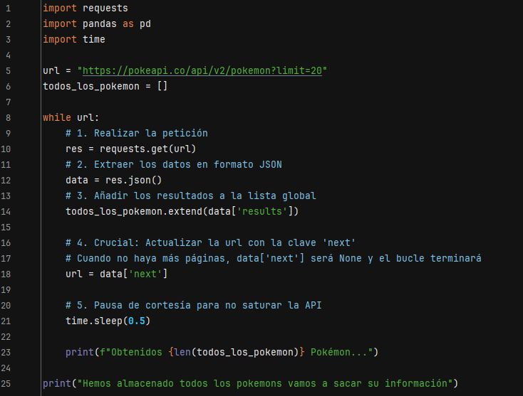
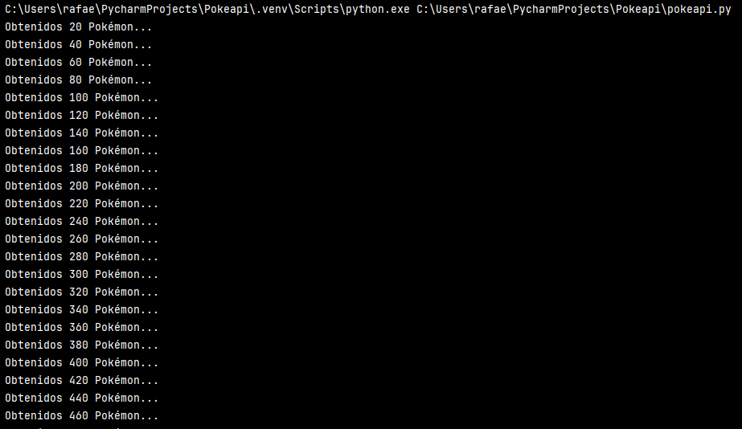
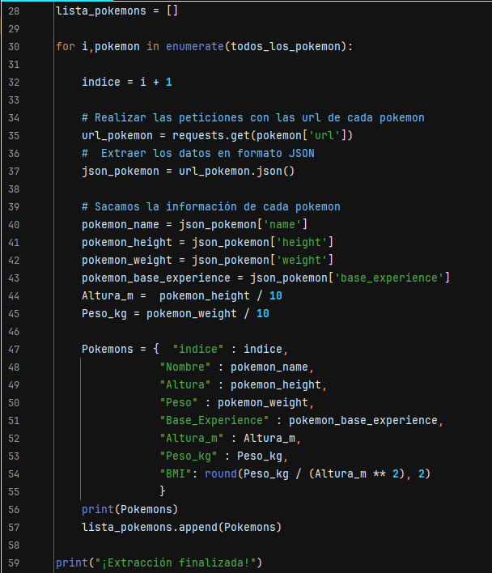
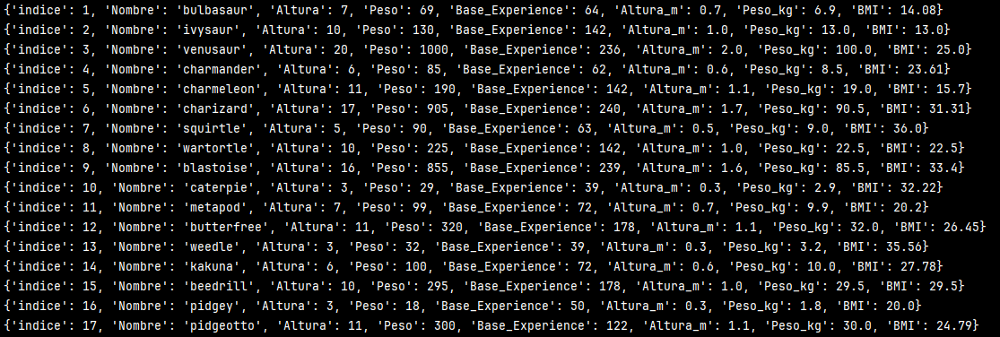
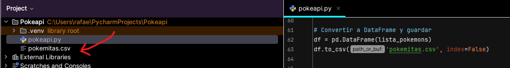
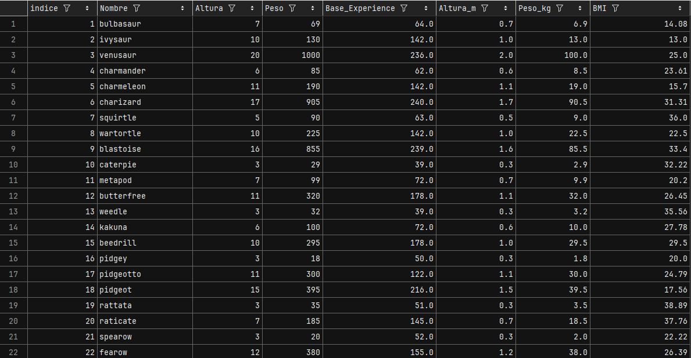

# Informe de Proyecto: Proceso ETL con PokéAPI

## 1. Descargar datos de la PokeApi
El objetivo de la tarea es hacer un bucle `While` con el que sacaremos la información de los pokemons de la API. Esta tiene para cada uno una lista de su información básica; posteriormente, entraremos a la información detallada de cada pokemon y extraeremos sus datos según nos venga en necesidad.

---

## 2. Evidencias de la Invocación

### Código del bucle while para la paginación

### Progreso de las consultas
Captura de pantalla de la consola mostrando el progreso de las consultas (las URLs visitadas).

---

## 3. Evidencias de la Transformación

En mi caso usé un bucle `for` para hacer lo mismo: sacar la información de cada enlace. Posteriormente, volví a transformar los datos en valores JSON, almacenamos los valores en una variable para luego meterlo en un diccionario y haciendo la operación del **BMI (IMC)**. Finalmente, muestro los datos para ver si están saliendo de la manera correcta, después meto todos los pokemons en un vector para poder controlarlos y más tarde guardarlo en un `.csv`.

### Fragmento de código donde realizas el cálculo del BMI (IMC)

### Captura de pantalla de las primeras 5 filas del DataFrame resultante (df.head())

### Parte de código que saca el documento .csv

### Resultado final en el csv

---

## 4. Respuesta a las Preguntas de Reflexión

**1. ¿Por qué es importante actualizar la URL con el enlace next en lugar de simplemente incrementar un número de página manualmente?**
Porque si no tendría que lanzar constantemente el programa para que lea las siguientes líneas. En este caso solo tenemos 1350 datos, pero si llegara a ser que tenemos millones de datos es una manera de dejarlo automático y no tener a alguien pendiente del programa.

**2. ¿Qué ventaja tiene normalizar las unidades (como pasar de decímetros a metros) dentro del propio proceso ETL en lugar de hacerlo después en una hoja de cálculo?**
Te ahorras trabajo futuro: si tienes que procesar esos datos de alguna manera, ya los tienes listos. A la hora de hacer el trabajo te ahorras ese paso y, con unas simples líneas de código, ya los tienes procesados sin necesidad de usar fórmulas en la hoja de cálculo o hacerlo de manera manual.

**3. Si la API tuviera un límite de 1000 registros por página, ¿cómo afectaría esto al rendimiento de tu script?**
Por lo que tengo entendido, si le ponemos un límite de registros pequeño (como nosotros hacemos con 20) hacemos que nuestro ordenador sea más productivo gestionando la memoria RAM, ya que no cargamos el sistema procesando demasiados datos a la vez. Sin embargo, hay que tener en cuenta la latencia: si tengo mala cobertura (como me ha pasado en casa), se nota el tiempo de las llamadas y respuestas al ir de 20 en 20.
Al hacerlo de una sola vez con los 1350 (o bloques grandes como 1000), tarda menos en total por la red, pero mi ordenador tuvo unos segundos en los cuales se quedó algo más lento al llegarle todos esos registros de una sola vez para procesarlos.

---

## 5. Conclusión
La automatización de la extracción de datos desde APIs externas frente a la descarga manual permite manejar grandes volúmenes de información de forma eficiente, escalable y sin errores humanos, optimizando tanto el tiempo de trabajo como la calidad de los datos finales.