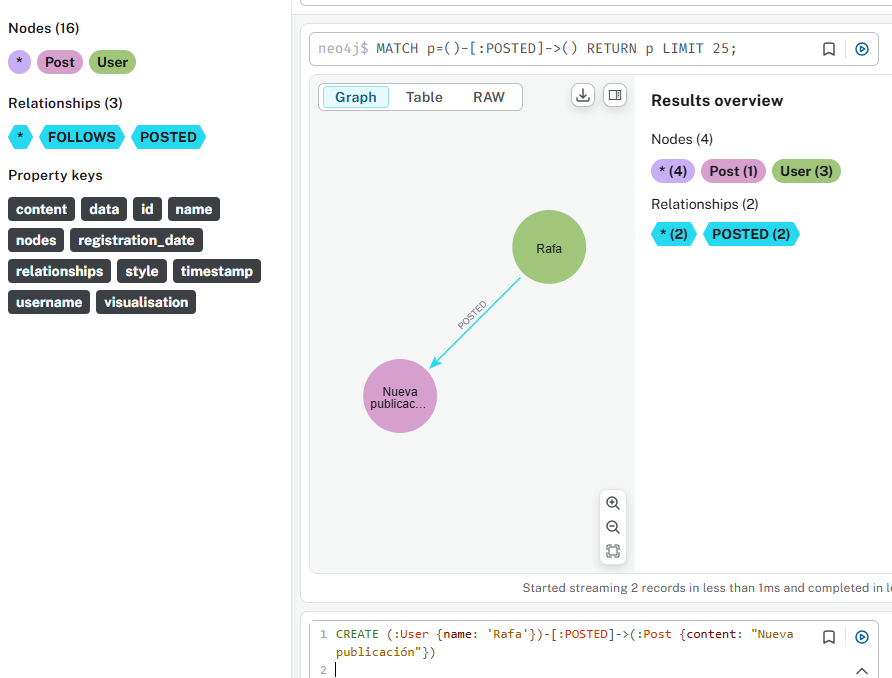
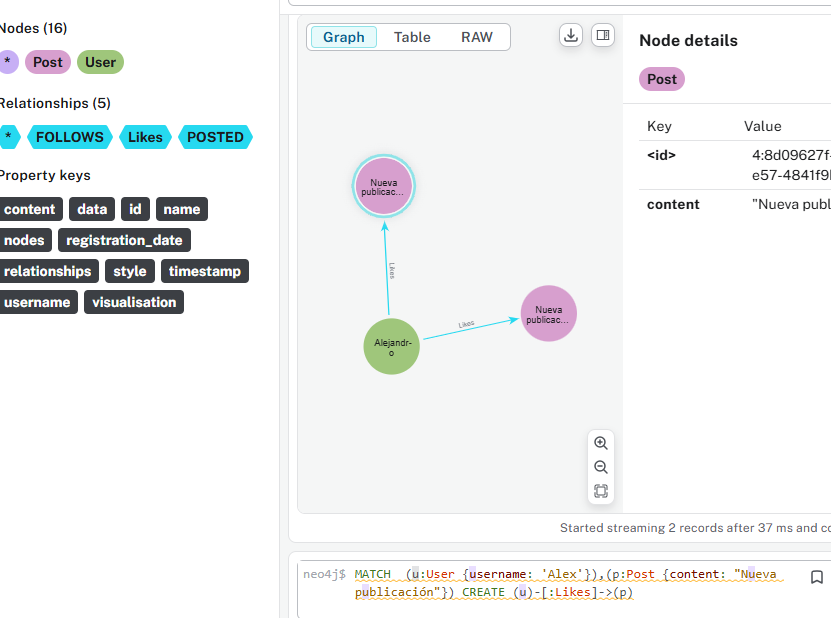
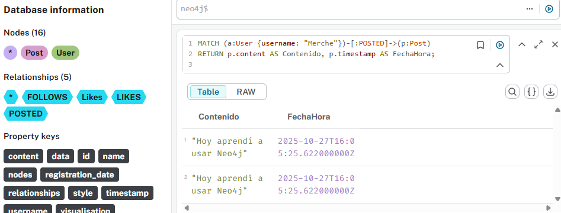
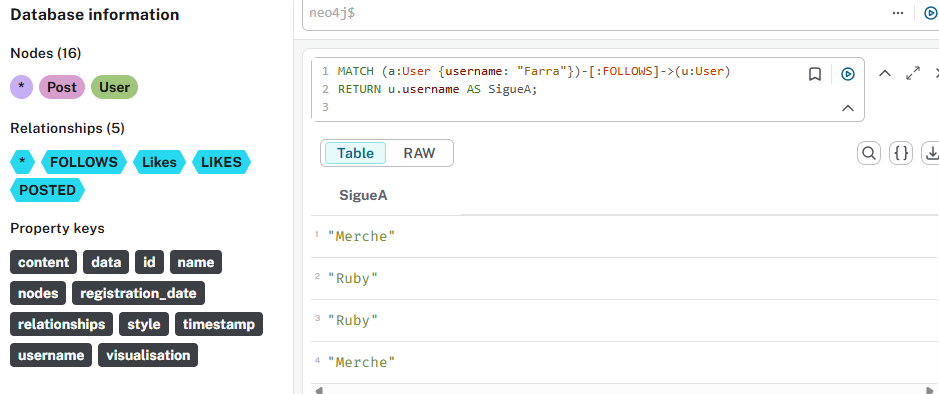

# Práctica 4 - Neo4j: Red Social  
**Autor:** Rafael Sosa  

---

## Ejercicio 1: Diseño del Modelo de Datos de la Red Social

Diseña un modelo de datos de grafo para representar usuarios y sus interacciones en una red social.  
Considera los siguientes tipos de nodos y relaciones:

### 🔹 Nodos:
- **User:** con propiedades como `username`, `name`, `registration_date`.  
- **Post:** con propiedades como `content`, `timestamp`.

### 🔹 Relaciones:
- **FOLLOWS:** entre `User` y `User`.  
- **POSTED:** entre `User` y `Post`.  
- **LIKES:** entre `User` y `Post`.

---

## Ejercicio 2: Creación de Nodos y Relaciones Iniciales

Utiliza **Cypher** para crear los siguientes nodos y relaciones en tu base de datos.

### Creación de nodos
Crea al menos tres nodos de tipo `User` con las propiedades `username`, `name` y `registration_date`.  
Asegúrate de que los `username` sean únicos.  

  

---

### Relaciones FOLLOWS
Crea algunas relaciones de tipo `FOLLOWS` entre tus usuarios.  
Por ejemplo: “Alice sigue a Bob”, “Bob sigue a Charlie”.

  

---

### Creación de Posts y relaciones POSTED
Haz que al menos dos usuarios publiquen un `Post`.  
Cada post debe tener propiedades `content` y `timestamp`.

  
  

---

### Relaciones LIKES
Haz que un usuario dé “Like” a un post de otro usuario.

  

---

## 🧩 Ejercicio 3: Encontrar Amigos y Seguidores

### Encontrar todos los usuarios que un usuario específico sigue
Escribe una consulta **Cypher** para encontrar todos los usuarios que ‘Alice’ (o cualquier otro) sigue.

---

### Encontrar todos los usuarios que siguen a un usuario específico
Escribe una consulta **Cypher** para encontrar todos los usuarios que siguen a ‘Bob’ (o cualquier otro usuario que hayas creado).

---

## Ejercicio 4: Analizando Posts e Interacciones

### Encontrar todos los posts de un usuario específico
Escribe una consulta **Cypher** para encontrar todos los posts de ‘Alice’ (o cualquier usuario que hayas creado), mostrando el contenido y la fecha/hora.

---

### Encontrar los posts que un usuario ha dado “Like”
Escribe una consulta **Cypher** para encontrar los posts a los que ‘Alice’ (o cualquier usuario que hayas creado) ha dado “Like”, mostrando el contenido del post.

---

## Ejercicio 5: Explorando el Grafo Visualmente

Ejecuta algunas de tus consultas anteriores en el **Neo4j Browser** y experimenta con las opciones de visualización:

- Arrastra nodos para reorganizar el grafo.  
  

- Haz doble clic en un nodo para expandir sus relaciones.  
  

- Usa el panel de estilos para cambiar colores y tamaños de nodos o relaciones.  
  

