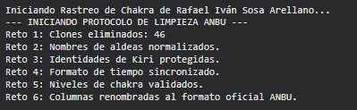
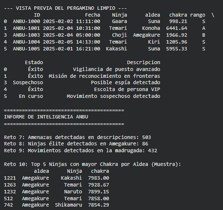
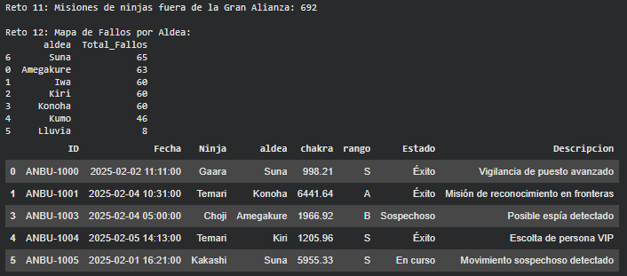

# Misión: Rastreo de Chakra y Limpieza de Pergaminos ANBU 📜

**Alumno / Ninja:** Rafael Iván Sosa Arellano  

---

## 1. Descripción de la Misión
Esta investigación consiste en el procesamiento y análisis técnico de los registros de misiones ninja (1,500+ entradas). El objetivo es purificar una base de datos corrupta por registros duplicados y errores de formato para identificar amenazas críticas, movimientos nocturnos no autorizados y el estado de eficiencia de las Grandes Aldeas Ninja.

---

## 2. Bloque A: Limpieza de Datos (Evidencias)

En esta fase se transformó la base de datos bruta en un informe profesional. Se utilizaron prints estratégicos para validar la eliminación de duplicados y el cambio de formato.

### Código de Limpieza (Retos 1-6)
```python
import pandas as pd
import numpy as np

def limpiar_registro(df):
    print("--- INICIANDO PROTOCOLO DE LIMPIEZA ANBU ---")
    
    # Reto 1: Elimina filas duplicadas
    antes = len(df)
    df = df.drop_duplicates().copy()
    print(f"Reto 1: Clones eliminados: {antes - len(df)}")

    # Reto 2: Estandariza la columna 'aldea'
    df['aldea'] = df['aldea'].astype(str).str.strip().str.replace('_', '').str.capitalize()
    print("Reto 2: Nombres de aldeas normalizados.")

    # Reto 3: Relleno de ninjas anónimos en Kiri
    mask_kiri_null = (df['nin_id'].isna()) & (df['aldea'] == 'Kiri')
    df.loc[mask_kiri_null, 'nin_id'] = 'Ninja de la Niebla Anonimo'
    print("Reto 3: Identidades de Kiri protegidas.")

    # Reto 4: Convierte 'ts' a datetime
    df['ts'] = pd.to_datetime(df['ts'], errors='coerce')
    print("Reto 4: Formato de tiempo sincronizado.")

    # Reto 5: Filtra niveles de chakra imposibles (0 < chakra <= 100,000)
    df = df[(df['chakra'] > 0) & (df['chakra'] <= 100000)].copy()
    print("Reto 5: Niveles de chakra validados.")

    # Reto 6: Renombra las columnas al formato oficial
    df = df.rename(columns={
        'id_reg': 'ID', 'ts': 'Fecha', 'nin_id': 'Ninja', 
        'status': 'Estado', 'desc': 'Descripcion'
    })
    print("Reto 6: Columnas renombradas.")
    
    print("\n--- VISTA PREVIA DEL PERGAMINO LIMPIO ---")
    print(df.head())
    return df 

````
### Resultado del codigo:



## 3. Bloque B: Búsqueda y Consultas (Evidencias)

En esta fase, el equipo ANBU utiliza el pergamino ya purificado para localizar infiltrados y analizar el estado de las naciones.

### Código de Consultas (Retos 7-12)

````python
def realizar_consultas(df):
    print("\n" + "="*45)
    print("      INFORME DE INTELIGENCIA ESTRATÉGICA")
    print("="*45)
    
    # Reto 7: Detección de palabras prohibidas (Detección de Amenazas)
    # Buscamos patrones de espionaje en las descripciones
    patron = 'espía|sospechoso|enemigo'
    amenazas = df[df['Descripcion'].str.contains(patron, case=False, na=False)]
    print(f"Reto 7: Amenazas críticas detectadas: {len(amenazas)}")

    # Reto 8: Ninjas élite de Amegakure (Chakra > 5000 y rango alto)
    ame_elite = df[(df['aldea'] == 'Amegakure') & (df['chakra'] > 5000) & (df['rango'] != 'D')]
    print(f"Reto 8: Ninjas de élite localizados en Amegakure: {len(ame_elite)}")

    # Reto 9: Vigilancia de Madrugada (Operaciones entre 23:00 y 05:00)
    madrugada = df[(df['Fecha'].dt.hour >= 23) | (df['Fecha'].dt.hour <= 5)]
    print(f"Reto 9: Movimientos detectados en la sombra (Madrugada): {len(madrugada)}")

    # Reto 10: Top 5 de Chakra por Aldea
    # Identificamos a los 5 ninjas más poderosos de cada nación
    print("\nReto 10: Registro de la Élite (Top 5 Chakra por Aldea):")
    top5 = df.sort_values(['aldea', 'chakra'], ascending=[True, False]).groupby('aldea').head(5)
    print(top5[['aldea', 'Ninja', 'chakra']].head(10))

    # Reto 11: Ninjas ajenos a la Gran Alianza (Konoha, Suna, Kumo)
    alianza = ['Konoha', 'Suna', 'Kumo']
    extranjeros = df[~df['aldea'].isin(alianza)]
    print(f"\nReto 11: Misiones de ninjas fuera de la Alianza: {len(extranjeros)}")

    # Reto 12: Mapa de Fallos (Conteo de misiones fallidas por aldea)
    fallos = df[df['Estado'] == 'Fallo'].groupby('aldea').size().sort_values(ascending=False)
    print("\nReto 12: Mapa de Fallos por Región:")
    print(fallos)
````
### Resultado del codigo:




## 4. Preguntas de Reflexión 🤔
### 1.¿Cuántos registros duplicados has encontrado y qué impacto tendrían en un análisis de Big Data si no se eliminaran?

Se detectaron 46 registros duplicados. En bases de datos de gran escala, no tratar estos elementos resulta ineficiente, ya que analizar la misma información varias veces no aporta valor adicional. Además, esto puede introducir sesgos en los resultados y supone un desperdicio innecesario de recursos de almacenamiento.

### 2.¿Por qué es crítico convertir la columna de fecha a datetime antes de realizar búsquedas por franja horaria?

La falta de estandarización provocará inconsistencias constantes en el sistema. Al no coincidir los formatos, especialmente en campos de fecha y hora, se generan discrepancias según la región geográfica (como ocurre con el formato anglosajón). Esto dificulta la sincronización de eventos y la integridad de los reportes.

### 3.¿Cómo has manejado los niveles de chakra > 100,000? ¿Crees que son errores de sensor o posibles técnicas prohibidas?
```python
df = df[(df['chakra'] > 0) & (df['chakra'] <= 100000)].copy()
```
Me apostaría un ojo con sharingan, a que son tecnicas prohibidas.
## 5. Conclusión 📜

La velocidad de procesamiento de un ordenador es incomparablemente superior a la capacidad humana. Mientras que una persona es propensa a cometer errores de omisión y difícilmente detectaría duplicados en grandes volúmenes, un sistema automatizado lo hace en segundos. En este caso manejamos 1,500 filas, pero en un escenario de 300,000, el trabajo manual sería inasumible; como le ocurría a Tsunade en Naruto, cuya carga administrativa constante como Hokage le impedía dedicarse a tareas más estratégicas.