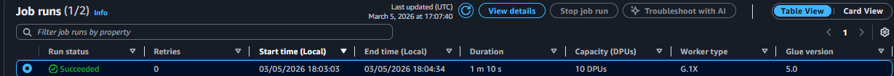
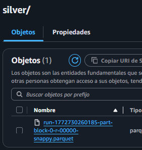
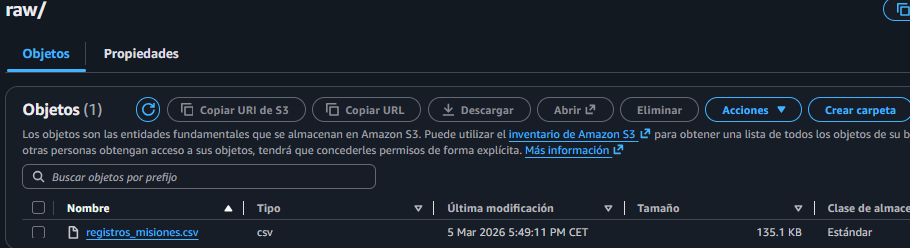
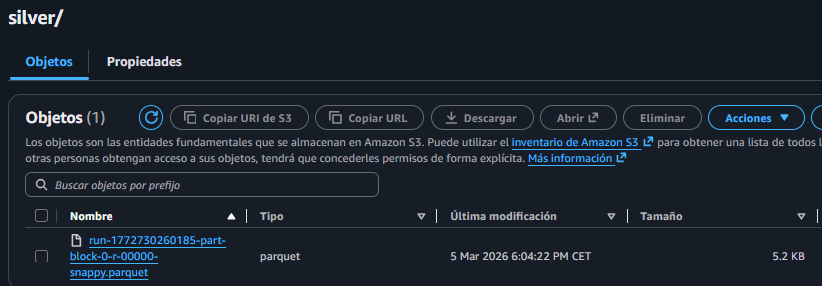

# Tarea UT 5 de Rafael Iván Sosa Arellano de la práctica (El Purificador de Pergaminos).

### Usamos las herramientas de S3 y AWS Glue.

## 1. Evidencias Cloud: Captura de pantalla del Job de Glue finalizado con éxito.

### En esta imagen vemos que se está correctamente acabado y nos deja un mensaje de completado.

### En esta segunda imagen podemos ver que se ha guardado en el directorio que le habiamos indicado en el flujo(En la carpeta "silver"). 

## 2. Análisis de Optimización: Tabla comparativa de los tamaños de archivo (CSV vs Parquet).

### Mi primer archivo pesa 135,1 de primeras osea mi CSV antes de pasar por los filtro y comprimirlo.

### Y en la segunda que enseñamos podemos apreciar que pesa menos, ya que esta con los nuevos filtros y esta comprimido asi que no hay había ningun error.

## 3. Reflexión: ¿Qué ventajas crees que tiene este proceso “Serverless” frente a procesar el archivo con un script manual en tu PC?
Con un simple flujo podemos tener toda una capeta nueva con sus propios filtros nuevos, y de una manera más sencilla y visual sin necesidad de tener tanta idea de programar, desde mi punto de vista es más simple para otras personas.