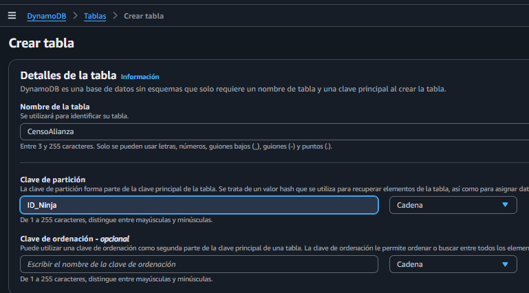
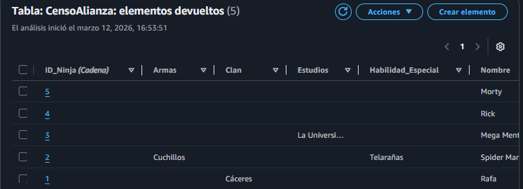
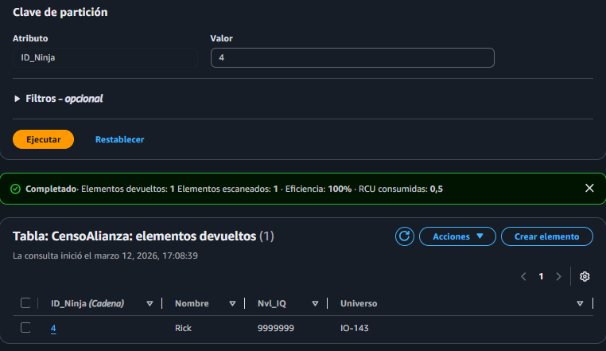
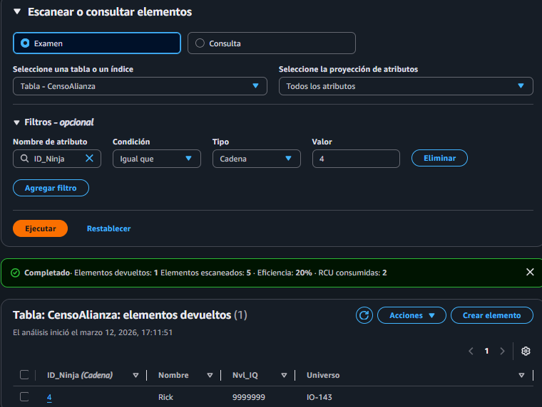
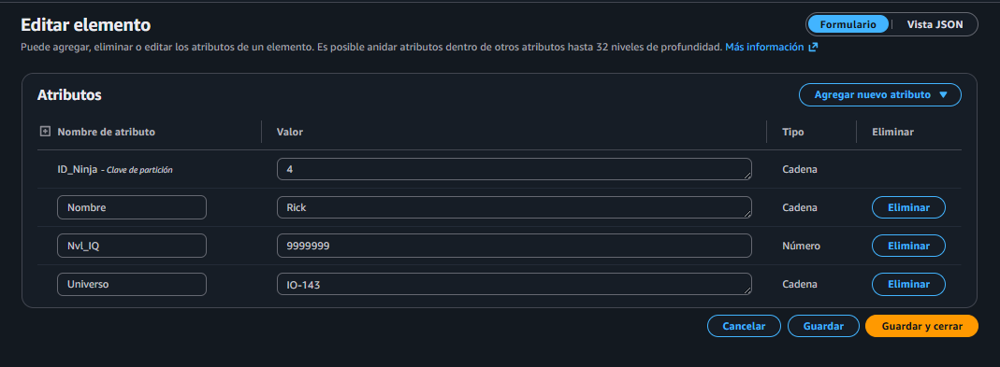
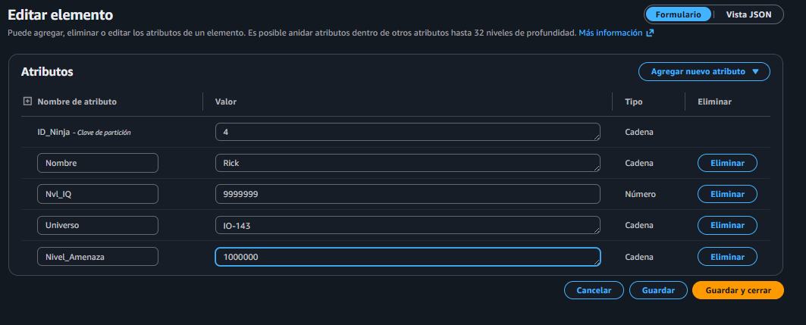

# Práctica 2. El Índice de las Sombras (NoSQL)
Rafael Iván Sosa Arellano
# Objetivo Técnico
### Diseñar un modelo de datos clave-valor optimizado para el acceso de alto rendimiento y entender la integridad de atributos en esquemas flexibles.
---
## 1. Creación de la Tabla Principal: Crea una tabla en DynamoDB llamada CensoAlianza.

--- 
## 2. Ingesta de Dados Críticos: Inserta manualmente (o mediante un script Python) al menos 5 registros. El reto: Cada registro debe ser diferente.

--- 
## 3. Simulación de Búsqueda ANBU: Usa el explorador de ítems para realizar:

### Una Query buscando por un ID_Ninja específico (mira la velocidad).

### Un Scan buscando a todos los ninjas de un “Clan” específico. 

### Reflexiona: ¿Por qué el Scan es mucho más lento y costoso que la Query?

Porque los scan tienen que anañlizar todo la DB para poder encontrar a todos los usuarios, y el Querry busca solo un especifico y cuando lo encuentra sale de su ejecución, en cambio de el Scan tiene que analizarlo hasta el final para saber exactamente cuantos quedan y que no le falte ninguno.

--- 

## 4. Actualización Dinámica: Modifica un registro existente añadiendo un atributo nuevo (ej: Nivel_Amenaza) que no existía anteriormente.

### ANTES DE HACER EL CAMBIO:

### DESPUES DE HACER EL CAMBIO:

---
### Respondiendo a las preguntas finales, esta es la ultima que me quedaría por enseñar sería esta:

(Explica qué Partition Key elegirías si tuvieras que buscar habitualmente por “Aldea” en lugar de por “ID” y qué es un Global Secondary Index (GSI).)

Pues si en vez de usar como Primary key la de ID porque no la vea tan necesaria tendría que cambiarla y usar la de Aldea y asi es más sencillo a posterior para filtros y demás.

Y un Secondary Index es un indice que permite consultar datos utilizando una clave de partición y de ordenación diferente a la de la tabla base