# Resultados de la consulta de Tafael Iván Sosa Arellano:
## Consultas:

## 0. Seleccioanr los 10 primeros
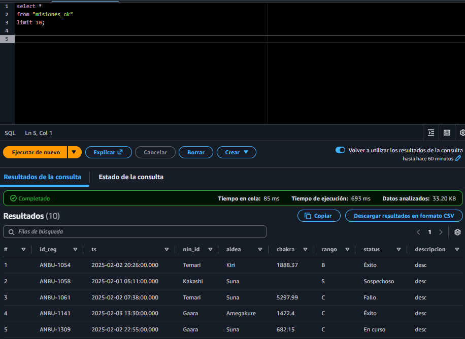

## 1. Número de misiones realizadas por cada ninja
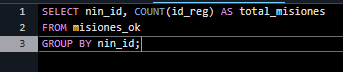
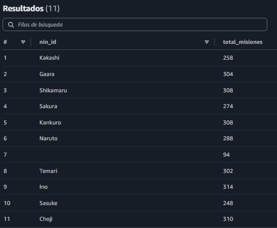

## 2. Misiones completadas con éxito
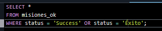
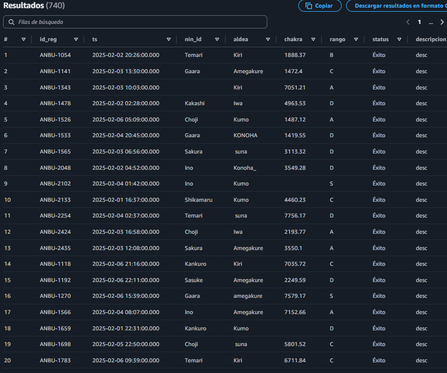

## 3. Chakra medio usado por cada ninja
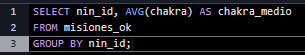
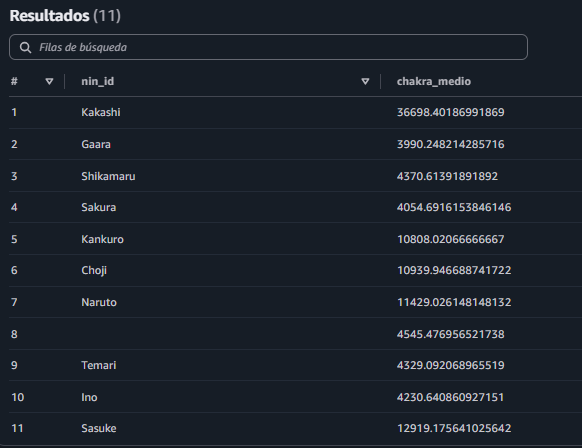

## 4. Número de misiones por aldea
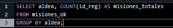
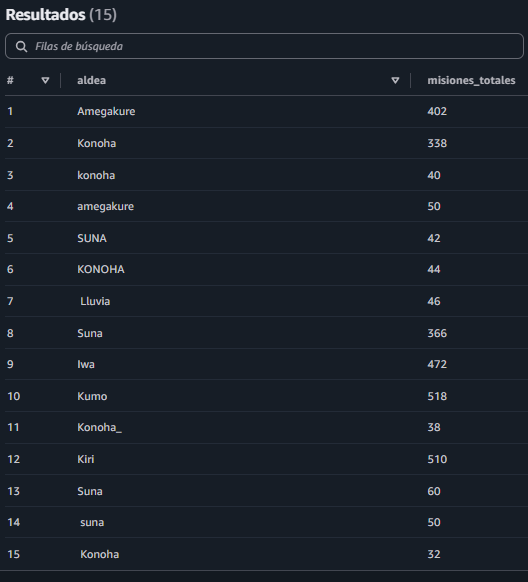

## 5. Misiones de rango alto (A o S)

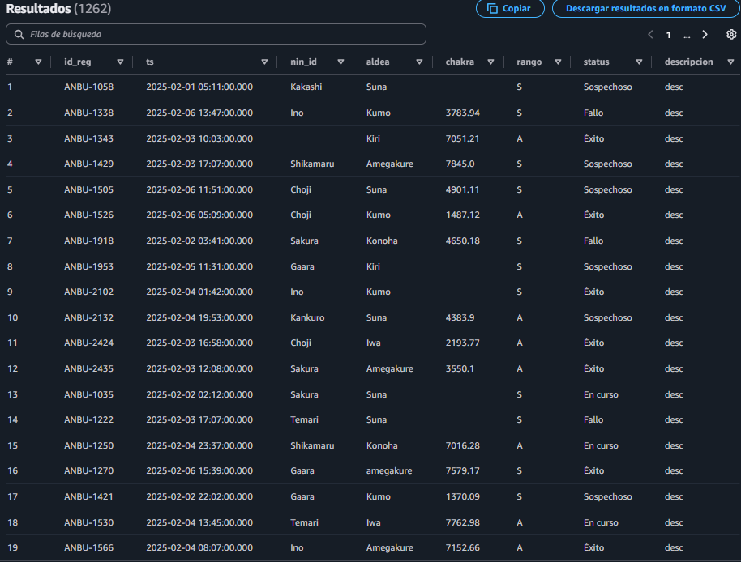

## 6. Realiza un GROUP BY para encontrar qué aldea ha realizado más actividades sospechosas en el último mes
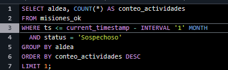
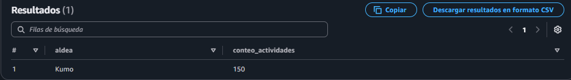
