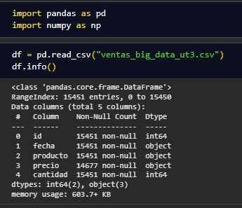
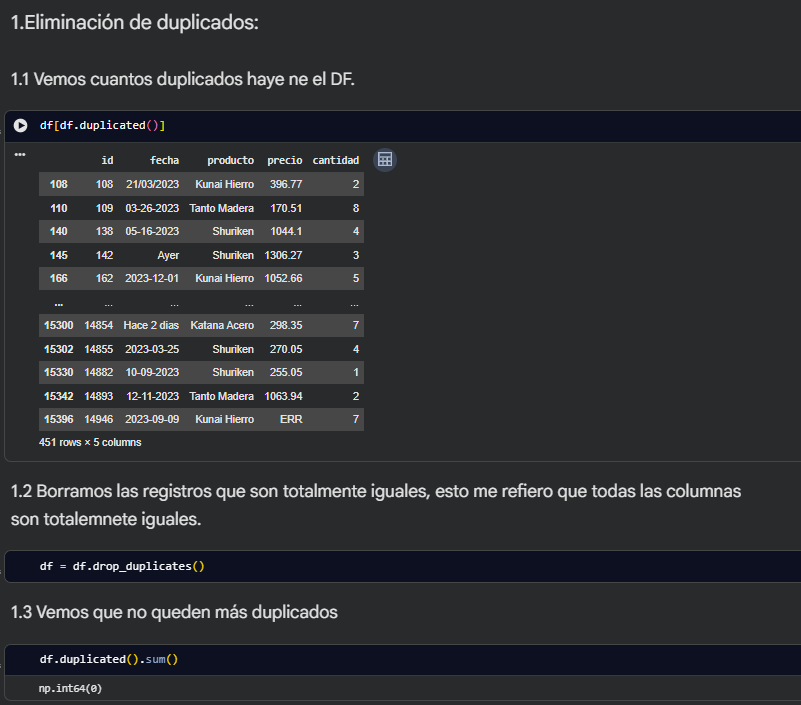
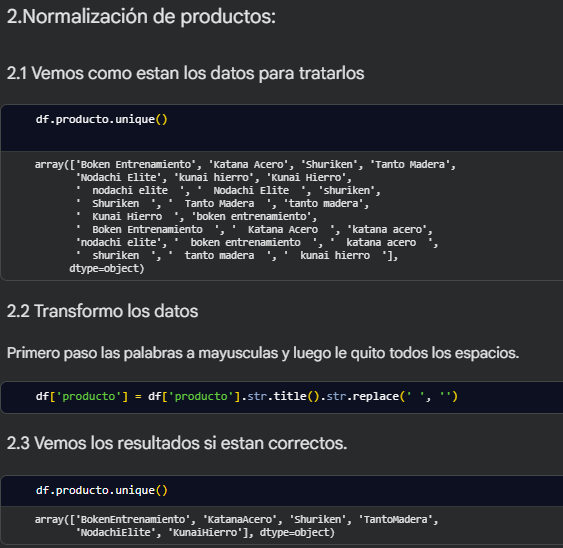
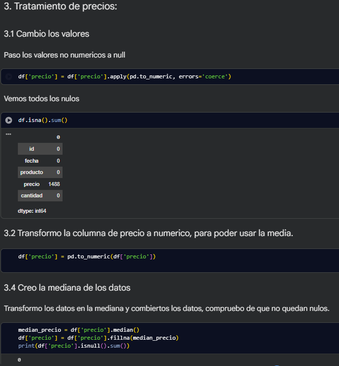
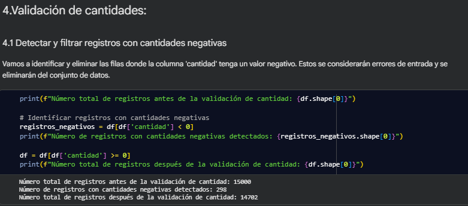
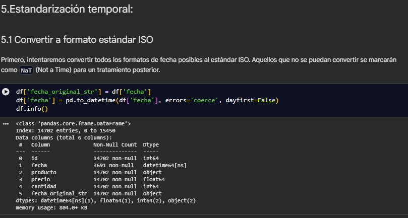
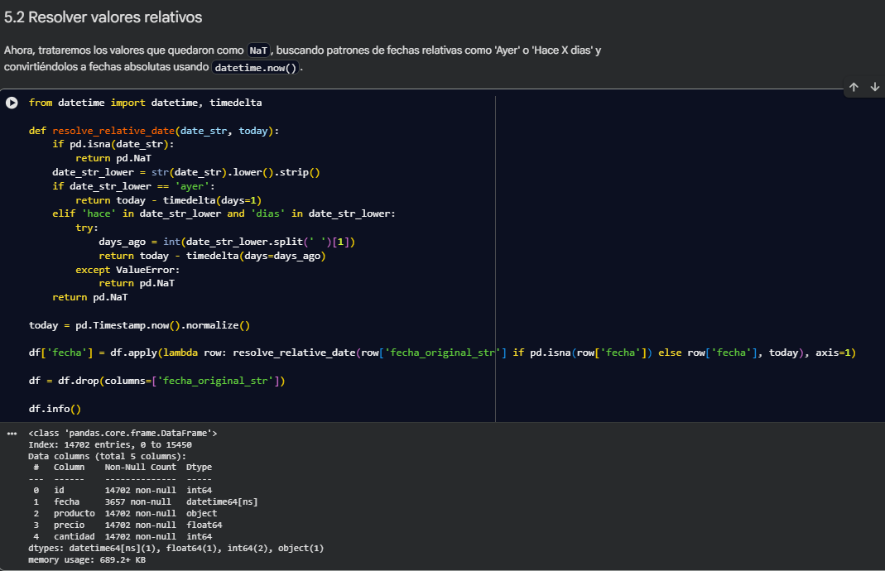
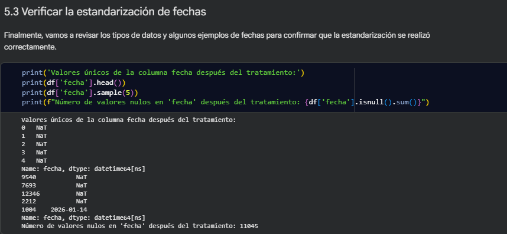

# 0. Información del DataFrame
* Vista general de la estructura de los datos.
* Revisión de tipos de datos y valores no nulos.

---
# 1. Eliminación de duplicados
* Se considera un duplicado cuando todos los campos de la fila son idénticos.
* Especial atención a los casos donde el id se repite pero los datos varían (estos no deben borrarse automáticamente).

---
# 2. Normalización de productos
* Eliminar espacios en blanco y convertir a formato CamelCase o Capitalizado.

---
# 3. Tratamiento de precios
* Localizar valores no numéricos (como “ERR”) y tratarlos como nulos.
* Imputar los valores faltantes utilizando la mediana de la columna.

---
# 4. Validación de cantidades
* Detectar y filtrar registros con cantidades negativas (considerarlos errores de entrada).

---
# 5. Estandarización temporal
* Convertir diversos formatos de fecha al estándar ISO.
* Resolver valores relativos como “Ayer” o “Hace 2 dias” calculando la fecha real respecto al día de hoy (usa datetime.now()).

