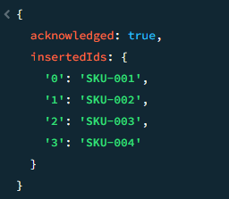
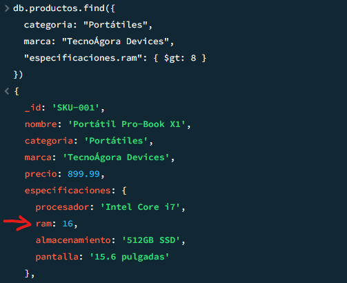
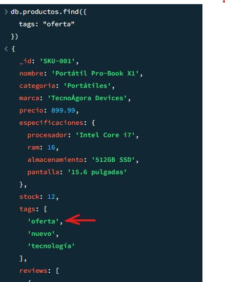
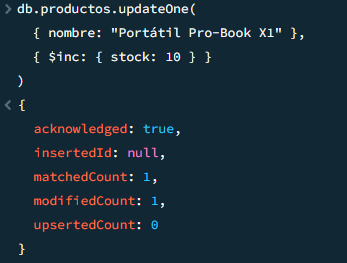
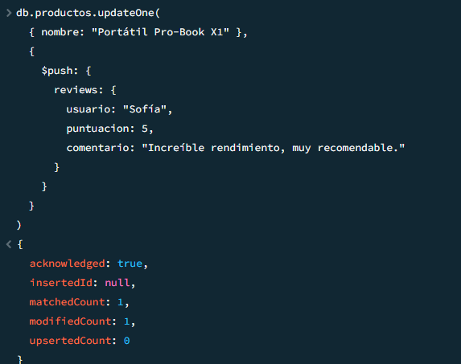
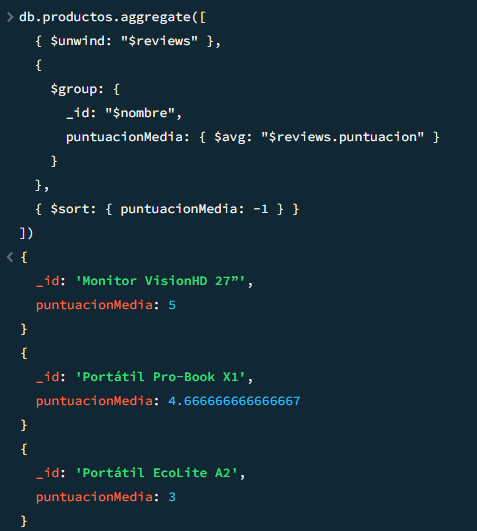
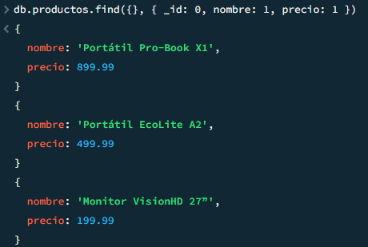
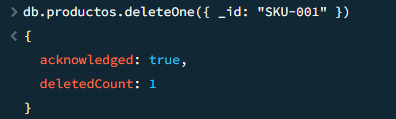

#  Práctica MongoDB – Consultas con find(), update y aggregate
---

##  Datos de ejemplo

```js
db.productos.insertMany([
  {
    _id: "SKU-001",
    nombre: "Portátil Pro-Book X1",
    categoria: "Portátiles",
    marca: "TecnoÁgora Devices",
    precio: 899.99,
    especificaciones: {
      procesador: "Intel Core i7",
      ram: 16,
      almacenamiento: "512GB SSD",
      pantalla: "15.6 pulgadas"
    },
    stock: 12,
    tags: ["oferta", "nuevo", "tecnología"],
    reviews: [
      { usuario: "Ana", puntuacion: 5, comentario: "Excelente rendimiento" },
      { usuario: "Luis", puntuacion: 4, comentario: "Muy bueno, aunque caro" }
    ]
  },
  {
    _id: "SKU-002",
    nombre: "Portátil EcoLite A2",
    categoria: "Portátiles",
    marca: "TecnoÁgora Devices",
    precio: 499.99,
    especificaciones: {
      procesador: "Intel Core i3",
      ram: 8,
      almacenamiento: "256GB SSD",
      pantalla: "14 pulgadas"
    },
    stock: 3,
    tags: ["rebaja", "ligero"],
    reviews: [
      { usuario: "Carlos", puntuacion: 3, comentario: "Cumple lo básico" }
    ]
  },
  {
    _id: "SKU-003",
    nombre: "Monitor VisionHD 27”",
    categoria: "Monitores",
    marca: "TecnoÁgora Devices",
    precio: 199.99,
    especificaciones: {
      resolucion: "1920x1080",
      tamaño: "27 pulgadas",
      tipo: "LED"
    },
    stock: 15,
    tags: ["oferta", "popular"],
    reviews: [
      { usuario: "María", puntuacion: 5, comentario: "Excelente calidad de imagen" }
    ]
  },
  {
    _id: "SKU-004",
    nombre: "Tablet GoTab S5",
    categoria: "Tablets",
    marca: "DigitalWorld",
    precio: 299.99,
    especificaciones: {
      procesador: "Snapdragon 680",
      ram: 6,
      almacenamiento: "128GB",
      pantalla: "10.5 pulgadas"
    },
    stock: 8,
    tags: ["portátil", "oferta"],
    reviews: []
  }
])
```



---

##  Ejercicio 1: Encontrar portátiles de una marca con más de 8GB de RAM

```js
db.productos.find({
  categoria: "Portátiles",
  marca: "TecnoÁgora Devices",
  "especificaciones.ram": { $gt: 8 }
})
```


---

##  Ejercicio 2: Buscar productos con la etiqueta “oferta”

```js
db.productos.find({ tags: "oferta" })
```


---

##  Ejercicio 3: Incrementar el stock de un producto en 10 unidades

```js
db.productos.updateOne(
  { nombre: "Portátil Pro-Book X1" },
  { $inc: { stock: 10 } }
)
```


---

##  Ejercicio 4: Añadir una nueva reseña (review) a un producto

```js
db.productos.updateOne(
  { nombre: "Portátil Pro-Book X1" },
  {
    $push: {
      reviews: {
        usuario: "Sofía",
        puntuacion: 5,
        comentario: "Increíble rendimiento, muy recomendable."
      }
    }
  }
)
```


---

##  Parte 3: Agregación — Puntuación media de reseñas

```js
db.productos.aggregate([
  { $unwind: "$reviews" },
  {
    $group: {
      _id: "$nombre",
      puntuacionMedia: { $avg: "$reviews.puntuacion" }
    }
  },
  { $sort: { puntuacionMedia: -1 } }
])
```


---

##  Parte 4: Ejercicios adicionales (opcional)

###  Mostrar productos con bajo stock (< 5)
```js
db.productos.find({ stock: { $lt: 5 } })
```


###  Mostrar solo nombre y precio (sin _id)
```js
db.productos.find({}, { _id: 0, nombre: 1, precio: 1 })
```


###  Eliminar un producto por su _id
```js
db.productos.deleteOne({ _id: "SKU-001" })
```



